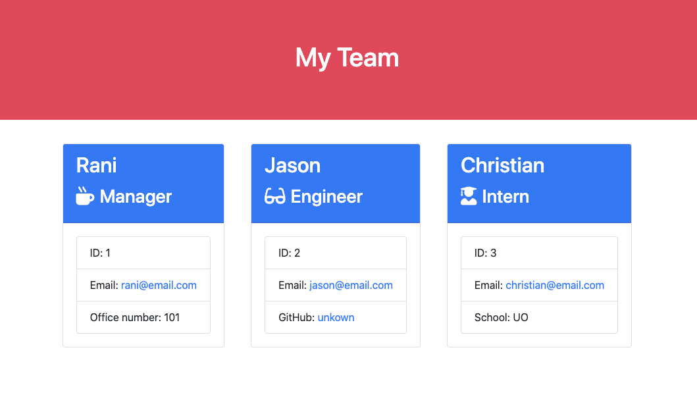
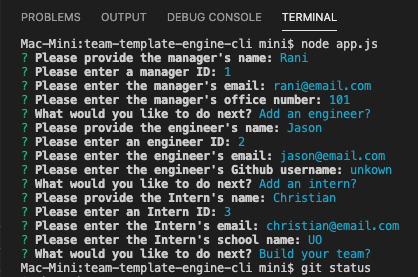

# Team Template Engine

## Description
This is a software engineering team generator command line application, that via a Node CLI, takes in information about employees and generates an HTML webpage that displays summaries for each person.

The application will prompt the user for information about the team manager and then information about the team members. The user can input any number of team members, and they may be a mix of engineers and interns. When the user has completed building the team, the application will create an HTML file that displays a nicely formatted team roster based on the information provided by the user.

## Table of Contents
* [Installation](#installation)
* [Usage](#usage)
* [License](#license)
* [Contributing](#contributing)
* [Tests](#tests)
* [Questions](#questions)

## Installation
From the command line ...
1. run npm init
2. run npm install inquirer
3. run npm install team-template-engine-cli

## Usage
1. run node app.js

  
2. Enter relevant info when prompted.

3. Push generated 'output' directory and 'team.html' file to GitHub.

4. See [walk-through](https://drive.google.com/file/d/1tBCsrq1wV5RYikmtemmlFpTeGOtrZjTL/view) video for help.

## License
This application is covered under the **GPL v3.0** license. Permissions of this strong copyleft license are conditioned on making available complete source code of licensed works and modifications, which include larger works using a licensed work, under the same license. Copyright and license notices must be preserved. Contributors provide an express grant of patent rights.

## Contributing
Please refer to the [Contributor Covenant](https://www.contributor-covenant.org/version/2/0/code_of_conduct/).

## Tests
There are unit tests for creating each type of employee (manager, engineer, or intern).

## Questions
Please direct any questions regarding this application to the developer @[HumbleKind](https://github.com/HumbleKind) (GitHub), or via email at christian_sinai@me.com.